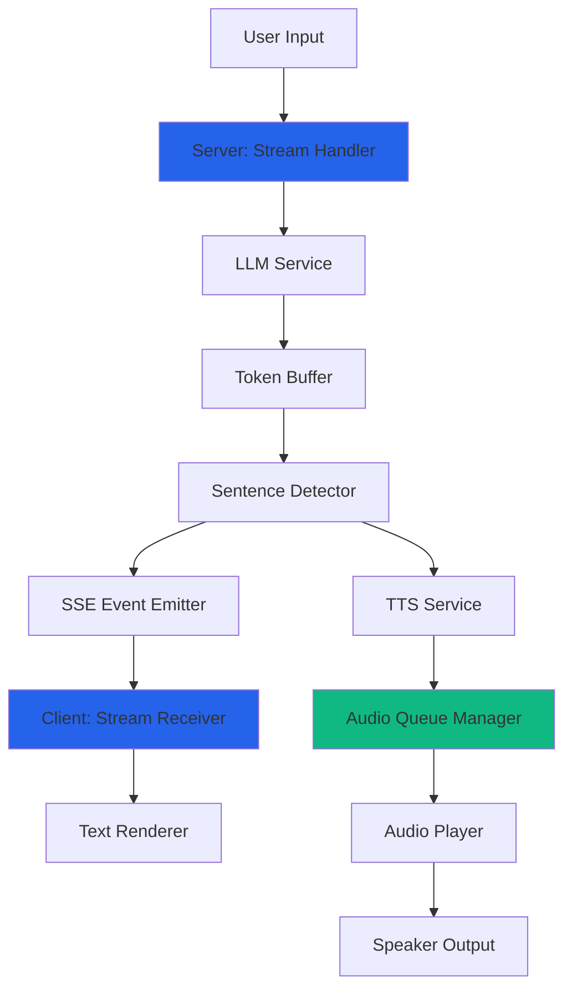
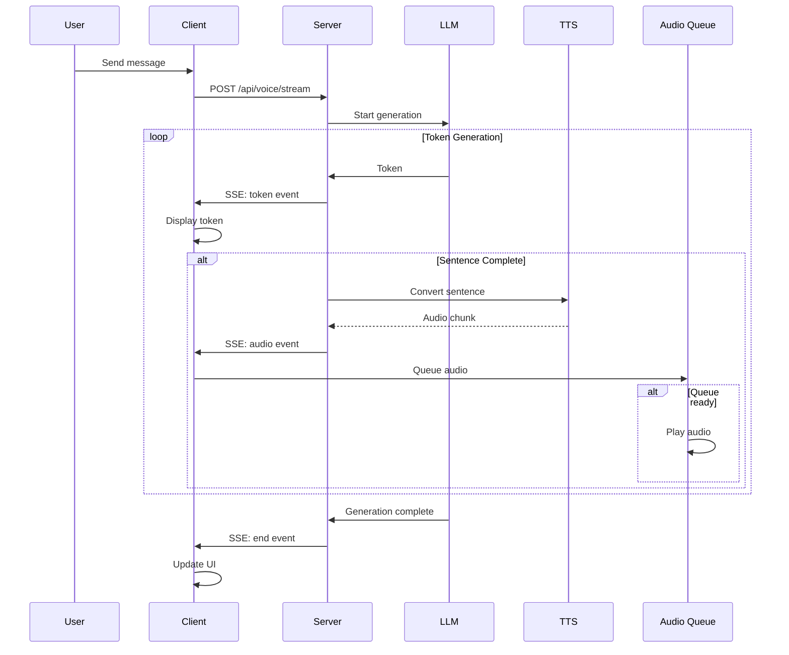

# Design Document

## Overview

This design implements a streaming voice tutor system that provides near-instantaneous audio feedback by progressively generating, converting, and playing AI responses. The architecture uses Server-Sent Events (SSE) for LLM streaming, sentence-level TTS conversion, and a client-side audio queue manager to create a natural, low-latency conversation experience.

The key innovation is the pipeline approach: while the LLM is still generating tokens, complete sentences are extracted and sent to TTS, and while TTS is converting those sentences, earlier audio chunks are already playing. This parallel processing reduces perceived latency from 5-10 seconds to 1-2 seconds.

## Architecture

### High-Level Flow

```
User Input → Server (SSE Stream) → Client
                ↓
         LLM Token Stream
                ↓
         Sentence Detector
                ↓
         TTS Service (parallel)
                ↓
         Audio Queue Manager
                ↓
         Sequential Playback
```

### Component Diagram



### Sequence Diagram



## Components and Interfaces

### 1. Server-Side Components

#### StreamingChatHandler
Manages SSE connections and coordinates streaming flow.

```typescript
interface StreamingChatHandler {
  handleStreamRequest(req: Request, res: Response): Promise<void>;
  setupSSEConnection(res: Response): void;
  emitEvent(res: Response, event: SSEEvent): void;
  closeConnection(res: Response): void;
}

interface SSEEvent {
  type: 'token' | 'sentence' | 'audio' | 'end' | 'error';
  data: string | AudioChunk;
  metadata?: {
    sentenceIndex?: number;
    isComplete?: boolean;
  };
}
```

#### SentenceDetector
Identifies sentence boundaries in streaming text.

```typescript
interface SentenceDetector {
  addTokens(tokens: string): void;
  getCompleteSentences(): string[];
  getRemainingBuffer(): string;
  reset(): void;
}

interface SentenceDetectorConfig {
  minSentenceLength: number; // Default: 10
  maxSentenceLength: number; // Default: 200
  boundaryPatterns: RegExp[];
  hinglishSupport: boolean;
}
```

#### StreamingTTSService
Converts sentences to audio in parallel.

```typescript
interface StreamingTTSService {
  convertSentence(text: string, index: number): Promise<AudioChunk>;
  getMaxParallelConversions(): number;
  setProvider(provider: 'elevenlabs' | 'browser'): void;
}

interface AudioChunk {
  index: number;
  buffer: Buffer;
  format: 'mp3' | 'wav';
  duration: number;
}
```

### 2. Client-Side Components

#### StreamReceiver
Handles SSE connection and event processing.

```typescript
interface StreamReceiver {
  connect(url: string, options: StreamOptions): void;
  onToken(callback: (token: string) => void): void;
  onSentence(callback: (sentence: string) => void): void;
  onAudio(callback: (audio: AudioChunk) => void): void;
  onEnd(callback: () => void): void;
  onError(callback: (error: Error) => void): void;
  disconnect(): void;
}

interface StreamOptions {
  conversationHistory: Message[];
  context?: QuestionContext;
  autoSpeak: boolean;
}
```

#### AudioQueueManager
Manages sequential playback of audio chunks.

```typescript
interface AudioQueueManager {
  enqueue(chunk: AudioChunk): void;
  play(): Promise<void>;
  pause(): void;
  clear(): void;
  getCurrentIndex(): number;
  getQueueLength(): number;
  onChunkStart(callback: (index: number) => void): void;
  onChunkEnd(callback: (index: number) => void): void;
  onQueueEmpty(callback: () => void): void;
}

interface AudioQueueConfig {
  maxQueueSize: number; // Default: 5
  preloadCount: number; // Default: 2
  gapThreshold: number; // Default: 100ms
}
```

#### TextStreamRenderer
Displays streaming text with visual indicators.

```typescript
interface TextStreamRenderer {
  appendToken(token: string): void;
  markSentenceComplete(sentenceIndex: number): void;
  highlightPlayingSentence(sentenceIndex: number): void;
  showTypingIndicator(): void;
  hideTypingIndicator(): void;
  getFullText(): string;
}
```

### 3. Shared Interfaces

#### Message Types
```typescript
interface StreamingMessage {
  id: string;
  role: 'user' | 'assistant';
  content: string;
  isStreaming: boolean;
  audioChunks?: AudioChunk[];
  timestamp: number;
}

interface QuestionContext {
  id: string;
  question: string;
  studentAnswer: string;
  feedback: string;
  topic: string;
  concept?: string;
}
```

## Data Models

### Server-Side Models

```typescript
// Token buffer for sentence detection
class TokenBuffer {
  private buffer: string = '';
  private sentences: string[] = [];
  
  addToken(token: string): void;
  extractSentences(): string[];
  getRemaining(): string;
}

// SSE connection state
interface SSEConnection {
  id: string;
  response: Response;
  isActive: boolean;
  startTime: number;
  messageCount: number;
}

// TTS job queue
interface TTSJob {
  id: string;
  sentenceIndex: number;
  text: string;
  status: 'pending' | 'processing' | 'complete' | 'failed';
  audioChunk?: AudioChunk;
  createdAt: number;
}
```

### Client-Side Models

```typescript
// Audio queue item
interface QueuedAudio {
  index: number;
  blob: Blob;
  url: string;
  duration: number;
  status: 'queued' | 'playing' | 'played';
}

// Stream state
interface StreamState {
  isActive: boolean;
  currentText: string;
  sentences: string[];
  audioQueue: QueuedAudio[];
  currentAudioIndex: number;
  error?: Error;
}

// UI state
interface VoiceTutorUIState {
  isListening: boolean;
  isStreaming: boolean;
  isSpeaking: boolean;
  currentSpeakingIndex: number;
  autoSpeak: boolean;
  messages: StreamingMessage[];
}
```

## Correctness Properties

*A property is a characteristic or behavior that should hold true across all valid executions of a system—essentially, a formal statement about what the system should do. Properties serve as the bridge between human-readable specifications and machine-verifiable correctness guarantees.*


### Property Reflection

After analyzing all acceptance criteria, several properties can be consolidated:

**Redundancies Identified:**
- Properties 1.1 and 6.2 both test token streaming - can be combined into one comprehensive property
- Properties 9.1, 9.2, 9.3, 9.4, 9.5 all test UI indicators - can be combined into a single UI state consistency property
- Properties 4.1 and 4.2 both test punctuation detection - can be combined into one boundary detection property
- Properties 7.1, 7.2, 7.3, 7.4, 7.5 all test error handling - can be consolidated into fewer comprehensive error handling properties
- Properties 5.3 and 5.4 overlap with UI indicator properties

**Consolidated Properties:**
After consolidation, we have 25 unique, non-redundant properties that provide comprehensive coverage.

### Correctness Properties

Property 1: Progressive token streaming
*For any* chat message, when the LLM generates a response, tokens should arrive at the client in multiple progressive events rather than a single batch, with the first token arriving within 200ms
**Validates: Requirements 1.1, 1.3, 6.2**

Property 2: Real-time text display
*For any* sequence of streaming tokens, the UI should update to display each token as it arrives without waiting for the complete response
**Validates: Requirements 1.2**

Property 3: Sentence boundary buffering
*For any* stream of tokens without sentence boundaries, the system should buffer them without emitting to TTS until a boundary is detected
**Validates: Requirements 1.4**

Property 4: Immediate sentence emission
*For any* token stream containing a sentence boundary, the complete sentence should be emitted for TTS processing immediately upon boundary detection
**Validates: Requirements 1.5, 2.1**

Property 5: Non-blocking audio queueing
*For any* generated audio chunk, it should be queued for playback without waiting for subsequent sentences to complete TTS conversion
**Validates: Requirements 2.2**

Property 6: First audio latency
*For any* chat request, when the first audio chunk is ready, playback should begin within 2 seconds of the original request
**Validates: Requirements 2.3, 8.1**

Property 7: Parallel TTS limit
*For any* stream with multiple sentences, the system should process at most 3 sentences in parallel for TTS conversion
**Validates: Requirements 2.4**

Property 8: TTS fallback continuity
*For any* sentence where ElevenLabs TTS fails, the system should fall back to browser TTS and continue streaming without interruption
**Validates: Requirements 2.5, 7.1**

Property 9: Audio queue ordering
*For any* sequence of audio chunks, they should be queued and played in the same order as their corresponding sentences were generated
**Validates: Requirements 3.1**

Property 10: Seamless audio transitions
*For any* two consecutive audio chunks in the queue, the gap between the end of the first and start of the second should be less than 100ms
**Validates: Requirements 3.2**

Property 11: Graceful queue waiting
*For any* active stream where the audio queue becomes empty, the system should wait for the next chunk without displaying errors or stopping
**Validates: Requirements 3.3**

Property 12: Interruption cleanup
*For any* new message sent during active streaming or audio playback, the system should immediately clear the audio queue, stop playback, and cancel the stream
**Validates: Requirements 3.4, 5.2**

Property 13: Buffering strategy
*For any* stream, the system should buffer at least 2 audio chunks before starting playback to handle network latency
**Validates: Requirements 3.5**

Property 14: Punctuation boundary detection
*For any* text containing periods followed by spaces, question marks, or exclamation points, these should be correctly identified as sentence boundaries
**Validates: Requirements 4.1, 4.2**

Property 15: Long sentence splitting
*For any* text exceeding 200 characters without a sentence boundary, the system should split it at the nearest comma or conjunction
**Validates: Requirements 4.3**

Property 16: Multilingual punctuation support
*For any* Hinglish text containing both English and Devanagari punctuation marks, all punctuation types should be recognized as boundaries
**Validates: Requirements 4.4**

Property 17: Short sentence merging
*For any* sentence less than 10 characters, it should be appended to the next sentence to avoid fragmented audio
**Validates: Requirements 4.5**

Property 18: Streaming interruptibility
*For any* active stream, the user interface should remain responsive and allow sending new messages at any time
**Validates: Requirements 5.1**

Property 19: UI state consistency
*For any* streaming state (thinking, typing, speaking, buffering, complete), the appropriate visual indicators should be displayed and removed at the correct times
**Validates: Requirements 5.3, 5.4, 9.1, 9.2, 9.3, 9.4, 9.5**

Property 20: Partial content preservation on error
*For any* network error or interruption during streaming, the system should display all content received up to that point along with an appropriate error indicator
**Validates: Requirements 5.5, 7.4**

Property 21: SSE connection lifecycle
*For any* chat request, the server should establish an SSE connection, emit appropriate events (token, sentence, audio, end), and close the connection when generation completes
**Validates: Requirements 6.1, 6.3, 6.4**

Property 22: Error event emission
*For any* error occurring during streaming, the server should emit an error event with details before closing the connection
**Validates: Requirements 6.5**

Property 23: Streaming fallback
*For any* streaming failure, the system should fall back to non-streaming mode and display the complete response when available
**Validates: Requirements 7.2**

Property 24: Queue error resilience
*For any* audio chunk that fails to play, the system should skip it and continue with the next chunk in the queue
**Validates: Requirements 7.3**

Property 25: Timeout handling
*For any* LLM stream that times out, the system should display partial content and provide a retry option
**Validates: Requirements 7.5**

Property 26: Memory efficiency
*For any* active stream, the total memory used for buffering tokens, sentences, and audio chunks should not exceed 50MB
**Validates: Requirements 8.2**

Property 27: Queue size limit
*For any* audio queueing scenario, the queue should never contain more than 5 chunks simultaneously
**Validates: Requirements 8.3**

Property 28: Text-audio decoupling
*For any* slow TTS conversion, text display should continue streaming without blocking or waiting for audio generation
**Validates: Requirements 8.4**

Property 29: Network priority
*For any* slow network condition, text tokens should be prioritized and arrive before audio chunks
**Validates: Requirements 8.5**

Property 30: Conversation history preservation
*For any* interrupted or partial response, the full text content should be preserved in chat history and included in subsequent conversation context
**Validates: Requirements 10.1, 10.2, 10.3**

Property 31: Audio replay capability
*For any* previous message in the conversation history, clicking it should offer an option to replay the audio
**Validates: Requirements 10.4**

Property 32: Context window management
*For any* conversation, the system should maintain context for the most recent 10 messages when generating new responses
**Validates: Requirements 10.5**

## Error Handling

### Error Categories

1. **Network Errors**
   - Connection timeout during SSE
   - Network disconnection mid-stream
   - Slow network causing buffering issues

2. **TTS Errors**
   - ElevenLabs API failure
   - Audio format conversion errors
   - Browser TTS unavailable

3. **LLM Errors**
   - Generation timeout
   - Rate limiting
   - Invalid response format

4. **Client Errors**
   - Audio playback failure
   - Memory overflow
   - Browser compatibility issues

### Error Handling Strategies

```typescript
interface ErrorHandler {
  handleNetworkError(error: NetworkError): void;
  handleTTSError(error: TTSError): void;
  handleLLMError(error: LLMError): void;
  handleClientError(error: ClientError): void;
}

// Fallback chain
const ttsProviders = ['elevenlabs', 'browser'] as const;
const streamingModes = ['sse', 'polling', 'non-streaming'] as const;
```

### Recovery Mechanisms

1. **Automatic Retry**: Network errors retry up to 3 times with exponential backoff
2. **Graceful Degradation**: Fall back to simpler modes (streaming → non-streaming)
3. **Partial Success**: Display partial content even if complete response fails
4. **User Control**: Provide manual retry options for all error states

## Testing Strategy

### Unit Testing

**Server-Side Tests:**
- SentenceDetector: Test boundary detection with various punctuation patterns
- TokenBuffer: Test buffering and extraction logic
- StreamingTTSService: Test parallel conversion limits and error handling
- SSE Event Emitter: Test event formatting and emission

**Client-Side Tests:**
- AudioQueueManager: Test queueing, playback order, and interruption
- StreamReceiver: Test event parsing and callback invocation
- TextStreamRenderer: Test token appending and sentence highlighting
- Sentence boundary detection with edge cases (abbreviations, decimals, etc.)

**Integration Tests:**
- End-to-end streaming flow from request to audio playback
- Error recovery scenarios
- Interruption and cancellation flows
- Memory usage under load

### Property-Based Testing

We will use **fast-check** (JavaScript/TypeScript property-based testing library) for implementing property tests. Each property-based test will run a minimum of 100 iterations with randomly generated inputs.

**Key Property Tests:**

1. **Token Streaming Order**: Generate random token sequences, verify they arrive in order
2. **Sentence Boundary Detection**: Generate random text with various punctuation, verify correct splitting
3. **Audio Queue Ordering**: Generate random audio chunks, verify playback order matches generation order
4. **Memory Bounds**: Generate streams of varying lengths, verify memory stays under 50MB
5. **Timing Properties**: Generate random requests, verify first audio within 2 seconds
6. **Error Recovery**: Generate random failures, verify system continues functioning
7. **Interruption Handling**: Generate random interruption timings, verify clean cleanup
8. **Context Window**: Generate conversations of varying lengths, verify last 10 messages maintained

**Property Test Configuration:**
```typescript
// Each property test should use this configuration
const propertyTestConfig = {
  numRuns: 100,
  timeout: 5000,
  verbose: true
};
```

**Property Test Tagging:**
Each property-based test must include a comment tag in this format:
```typescript
// **Feature: streaming-voice-tutor, Property 1: Progressive token streaming**
```

### Performance Testing

**Metrics to Track:**
- Time to first token (target: < 200ms)
- Time to first audio (target: < 2s)
- Average gap between audio chunks (target: < 100ms)
- Memory usage during streaming (target: < 50MB)
- CPU usage during parallel TTS (target: < 70%)

**Load Testing:**
- Concurrent streaming sessions (target: 10 simultaneous users)
- Long conversation handling (target: 50+ messages)
- Network throttling scenarios (3G, 4G, WiFi)

### Browser Compatibility Testing

**Target Browsers:**
- Chrome/Edge (Chromium) - Primary
- Firefox - Secondary
- Safari - Secondary

**Features to Test:**
- SSE support
- Web Audio API
- Speech Recognition API
- Speech Synthesis API

## Implementation Notes

### Technology Choices

**Server-Side:**
- SSE over WebSockets: Simpler, unidirectional, better for streaming text
- Gemini Streaming API: Native support for token streaming
- ElevenLabs Streaming: Sentence-level conversion for lower latency

**Client-Side:**
- EventSource API: Native SSE support in browsers
- Web Audio API: Better control over audio playback and queueing
- React hooks: useState, useEffect, useRef for state management

### Performance Optimizations

1. **Token Batching**: Batch small tokens (< 3 chars) to reduce event overhead
2. **Audio Preloading**: Start loading next chunk while current is playing
3. **Memory Management**: Clear played audio chunks from memory immediately
4. **Sentence Caching**: Cache TTS results for common phrases
5. **Connection Pooling**: Reuse TTS service connections

### Security Considerations

1. **Rate Limiting**: Limit streaming requests per user (10/minute)
2. **Content Length**: Limit maximum response length (5000 tokens)
3. **Timeout Protection**: Hard timeout at 30 seconds
4. **Input Validation**: Sanitize all user inputs before streaming
5. **Resource Limits**: Enforce memory and CPU limits per session

### Accessibility

1. **Keyboard Navigation**: All controls accessible via keyboard
2. **Screen Reader Support**: Announce streaming status changes
3. **Visual Indicators**: Clear visual feedback for all states
4. **Pause/Resume**: Allow users to pause and resume audio
5. **Transcript Access**: Full text always available alongside audio

## Deployment Considerations

### Environment Variables

```bash
# Required
GEMINI_API_KEY=<key>
ELEVENLABS_API_KEY=<key>

# Optional
STREAMING_ENABLED=true
MAX_PARALLEL_TTS=3
AUDIO_QUEUE_SIZE=5
STREAM_TIMEOUT_MS=30000
MEMORY_LIMIT_MB=50
```

### Monitoring

**Key Metrics:**
- Streaming success rate
- Average time to first audio
- TTS fallback rate
- Error rates by category
- Memory usage per session

### Rollout Strategy

1. **Phase 1**: Deploy with feature flag, enable for 10% of users
2. **Phase 2**: Monitor metrics, fix issues, expand to 50%
3. **Phase 3**: Full rollout with fallback to non-streaming if issues detected

### Backward Compatibility

- Keep existing non-streaming endpoints functional
- Detect client capability and fall back automatically
- Provide user preference to disable streaming
