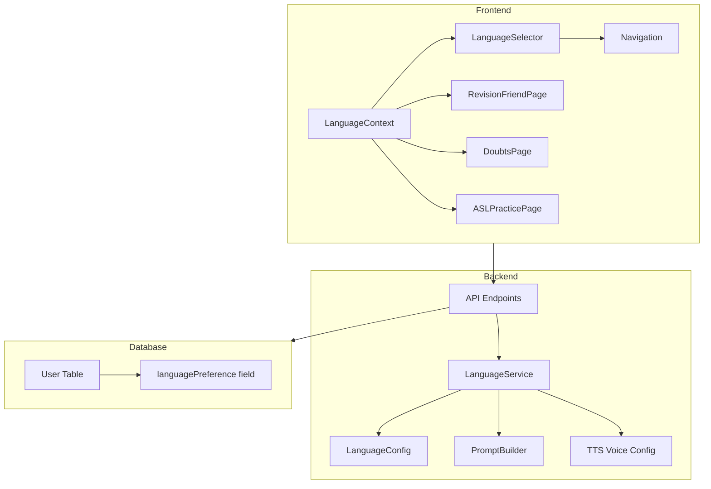

# Design Document: Multi-Language Support

## Overview

This feature adds multi-language support to the AI Teacher platform, enabling students from different Indian states to receive AI explanations in their preferred regional language mixed with English. The system will support 7 languages: Hindi (Hinglish), Tamil (Tanglish), Telugu (Tenglish), Kannada, Malayalam, Bengali, and Punjabi.

## Architecture



## Components and Interfaces

### 1. Language Configuration (`server/config/languages.ts`)

```typescript
interface LanguageConfig {
  code: string;           // e.g., 'hi', 'ta', 'te'
  name: string;           // e.g., 'Hindi', 'Tamil'
  nativeName: string;     // e.g., 'हिंदी', 'தமிழ்'
  mixName: string;        // e.g., 'Hinglish', 'Tanglish'
  flag: string;           // e.g., '🇮🇳'
  ttsVoiceId: string;     // ElevenLabs voice ID
  promptInstruction: string; // AI prompt instruction for this language
}

const SUPPORTED_LANGUAGES: LanguageConfig[] = [
  {
    code: 'hi',
    name: 'Hindi',
    nativeName: 'हिंदी',
    mixName: 'Hinglish',
    flag: '🇮🇳',
    ttsVoiceId: 'pNInz6obpgDQGcFmaJgB',
    promptInstruction: 'Respond in Hinglish (Hindi-English mix). Use Hindi words naturally mixed with English technical terms.'
  },
  {
    code: 'ta',
    name: 'Tamil',
    nativeName: 'தமிழ்',
    mixName: 'Tanglish',
    flag: '🇮🇳',
    ttsVoiceId: 'pNInz6obpgDQGcFmaJgB',
    promptInstruction: 'Respond in Tanglish (Tamil-English mix). Use Tamil words naturally mixed with English technical terms.'
  },
  // ... other languages
];
```

### 2. Language Context (`client/src/contexts/LanguageContext.tsx`)

```typescript
interface LanguageContextType {
  language: string;
  languageConfig: LanguageConfig;
  setLanguage: (code: string) => void;
  availableLanguages: LanguageConfig[];
}
```

### 3. Language Selector Component (`client/src/components/LanguageSelector.tsx`)

A dropdown component in the navigation bar that:
- Shows current language with flag and native name
- Displays all available languages in dropdown
- Updates context on selection

### 4. Language Service (`server/services/languageService.ts`)

```typescript
class LanguageService {
  getLanguageConfig(code: string): LanguageConfig;
  getPromptInstruction(code: string): string;
  getTTSVoiceId(code: string): string;
  getAllLanguages(): LanguageConfig[];
  isValidLanguage(code: string): boolean;
}
```

## Data Models

### User Table Update (Prisma Schema)

```prisma
model User {
  // ... existing fields
  languagePreference String @default("hi") // Language code
}
```

### Local Storage Schema

```typescript
interface LocalStorageLanguage {
  code: string;
  updatedAt: string; // ISO date
}
// Key: 'ai-teacher-language'
```

## Correctness Properties

*A property is a characteristic or behavior that should hold true across all valid executions of a system-essentially, a formal statement about what the system should do. Properties serve as the bridge between human-readable specifications and machine-verifiable correctness guarantees.*

### Property 1: Language preference persistence round-trip
*For any* valid language code and user (guest or authenticated), setting the language preference and then retrieving it should return the same language code.
**Validates: Requirements 1.2, 6.1, 6.2**

### Property 2: Language selector state consistency
*For any* language change via the selector, the URL should remain unchanged (no page reload) and the language context should reflect the new selection.
**Validates: Requirements 2.3**

### Property 3: AI prompt includes language instruction
*For any* language preference, when generating AI prompts for revision, doubts, or explanations, the prompt should contain the language-specific instruction from the configuration.
**Validates: Requirements 3.1**

### Property 4: TTS configuration uses correct voice and model
*For any* language preference, the TTS service should use the eleven_multilingual_v2 model and the voice ID specified in the language configuration.
**Validates: Requirements 4.1, 4.3**

### Property 5: Language configuration completeness
*For any* language in the supported languages list, the configuration should contain all required fields: code, name, nativeName, mixName, flag, ttsVoiceId, and promptInstruction.
**Validates: Requirements 7.3**

### Property 6: Database preference sync on login
*For any* user with a saved language preference, after login the language context should match the database value, and after logout the local storage preference should be retained.
**Validates: Requirements 6.3, 6.4**

## Error Handling

1. **Invalid Language Code**: If an invalid language code is provided, fall back to 'hi' (Hindi/Hinglish)
2. **Missing TTS Voice**: If TTS voice is unavailable, use default English voice with user notification
3. **Database Save Failure**: If saving to database fails, store in local storage and retry on next request
4. **Context Not Available**: If language context is not available, use default language from config

## Testing Strategy

### Unit Tests
- Language configuration validation
- Language service methods
- Context state management
- Local storage operations

### Property-Based Tests
Using fast-check library for TypeScript:

1. **Preference Persistence**: Generate random valid language codes, set preference, verify retrieval
2. **Prompt Generation**: Generate random languages, verify prompt contains language instruction
3. **TTS Configuration**: Generate random languages, verify correct voice ID and model
4. **Config Completeness**: For all languages, verify all required fields exist

### Integration Tests
- Language selector UI interaction
- API endpoint for saving/loading preferences
- Full flow: select language → generate content → verify language in response

### Test Configuration
- Property tests: minimum 100 iterations per property
- Use fast-check for property-based testing
- Tag each property test with: `**Feature: multi-language-support, Property {number}: {property_text}**`
