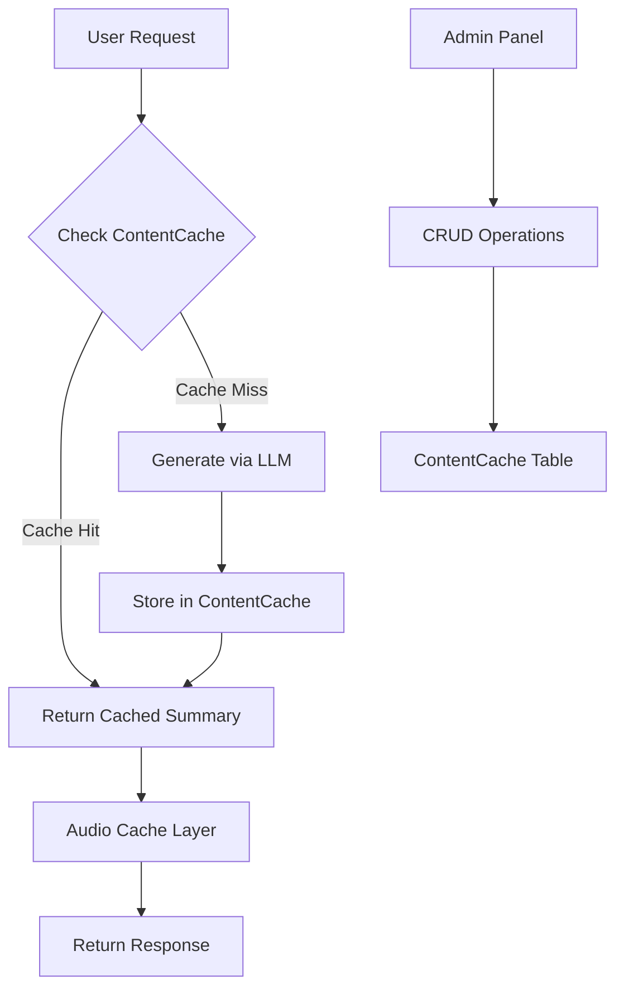

# Design Document: Chapter Summary Caching

## Overview

This feature introduces a database-backed caching layer for NCERT chapter summaries to eliminate redundant LLM calls. The system will store summaries in a `ContentCache` table, check this cache before making expensive AI calls, and provide an admin interface for manual summary management. This pattern is designed to be reusable across other features that have similar expensive content generation needs.

## Architecture



### Request Flow

1. User requests chapter summary
2. Service checks `ContentCache` table for existing summary
3. If found (cache hit): return cached content, update access stats
4. If not found (cache miss): generate via LLM, store in cache, return
5. Audio generation uses existing `AudioCacheRegistry` mechanism

## Components and Interfaces

### 1. Database Model: ContentCache

```prisma
model ContentCache {
  id              String   @id @default(uuid())
  
  // Cache key components
  module          String   // "ncert", "revision", "doubts", etc.
  contentType     String   // "summary", "explanation", "answer"
  subject         String?
  class           String?
  identifier      String   // chapterId, doubtId, etc.
  language        String   @default("en")
  
  // Content
  content         String   @db.Text
  title           String?
  
  // Source tracking
  source          String   // "manual", "llm", "import"
  
  // Usage tracking
  accessCount     Int      @default(0)
  lastAccessedAt  DateTime @default(now())
  
  // Metadata
  createdAt       DateTime @default(now())
  updatedAt       DateTime @updatedAt
  createdBy       String?  // Admin userId for manual entries
  
  @@unique([module, contentType, identifier, language])
  @@index([module, subject, class])
  @@index([lastAccessedAt])
}
```

### 2. Service Interface: ContentCacheService

```typescript
interface ContentCacheService {
  // Core operations
  get(key: CacheKey): Promise<CachedContent | null>;
  set(key: CacheKey, content: string, source: 'manual' | 'llm'): Promise<void>;
  delete(key: CacheKey): Promise<boolean>;
  
  // Batch operations
  getByModule(module: string, filters?: CacheFilters): Promise<CachedContent[]>;
  
  // Stats
  getStats(module?: string): Promise<CacheStats>;
  
  // Admin operations
  listWithStatus(module: string, subject?: string, class?: string): Promise<ChapterCacheStatus[]>;
}

interface CacheKey {
  module: string;
  contentType: string;
  identifier: string;
  language?: string;
}

interface CachedContent {
  content: string;
  title?: string;
  source: 'manual' | 'llm';
  accessCount: number;
  createdAt: Date;
  updatedAt: Date;
}

interface CacheStats {
  totalCached: number;
  manualEntries: number;
  llmGenerated: number;
  totalAccesses: number;
}
```

### 3. API Endpoints

#### Admin Endpoints

| Method | Endpoint | Description |
|--------|----------|-------------|
| GET | `/api/admin/content-cache` | List all cached content with filters |
| GET | `/api/admin/content-cache/chapters` | List chapters with cache status |
| POST | `/api/admin/content-cache` | Add/update cached content |
| DELETE | `/api/admin/content-cache/:id` | Delete cached content |
| GET | `/api/admin/content-cache/stats` | Get cache statistics |

#### Modified Existing Endpoints

| Endpoint | Change |
|----------|--------|
| `POST /api/ncert-explainer/chapter-summary` | Check cache first, store on miss |

### 4. Frontend Components

#### AdminSummaryPage

New page at `/admin/summaries` with:
- Chapter list grouped by subject/class
- Cache status indicators (green=cached, gray=not cached)
- Add/Edit modal with textarea for summary
- Filter controls (subject, class, cache status)
- Statistics dashboard

## Data Models

### CacheKey Structure

```typescript
// For NCERT summaries
{
  module: 'ncert',
  contentType: 'summary',
  identifier: 'english_10_firstflight_ch1', // chapterId
  language: 'en'
}

// For future use - Doubt explanations
{
  module: 'doubts',
  contentType: 'explanation',
  identifier: 'doubt_uuid',
  language: 'hi'
}
```

### Response Structure

```typescript
interface ChapterSummaryResponse {
  chapterId: string;
  chapterName: string;
  summary: string;
  source: 'cache' | 'generated';  // New field
  audioUrl: string;
  // ... existing fields
}
```

## Correctness Properties

*A property is a characteristic or behavior that should hold true across all valid executions of a system-essentially, a formal statement about what the system should do. Properties serve as the bridge between human-readable specifications and machine-verifiable correctness guarantees.*

### Property 1: Summary persistence round-trip
*For any* valid summary submission (chapterId, content), storing it in the cache and then retrieving it should return the same content.
**Validates: Requirements 1.3**

### Property 2: Cache hit returns cached content
*For any* chapter with a cached summary, requesting that chapter's summary should return the cached content without invoking the LLM service.
**Validates: Requirements 2.2**

### Property 3: Cache miss stores generated content
*For any* chapter without a cached summary, after requesting that chapter's summary, the cache should contain the generated content.
**Validates: Requirements 2.3**

### Property 4: Access count increments on retrieval
*For any* cached content, each retrieval should increment the access count by exactly 1.
**Validates: Requirements 3.2**

### Property 5: Filter query correctness
*For any* filter combination (module, subject, class), all returned cache entries should match all specified filter criteria.
**Validates: Requirements 3.3, 4.3**

### Property 6: Response structure consistency
*For any* summary response, whether from cache or generated, the response should contain all required fields (chapterId, chapterName, summary, source, audioUrl).
**Validates: Requirements 5.1**

### Property 7: Delete removes entry
*For any* existing cache entry, deleting it should result in subsequent get operations returning null.
**Validates: Requirements 1.5**

## Error Handling

| Scenario | Handling |
|----------|----------|
| Cache read failure | Log error, proceed to LLM generation |
| Cache write failure | Log error, return generated content anyway |
| LLM generation failure | Return user-friendly error, don't cache |
| Invalid cache key | Return 400 Bad Request with validation message |
| Admin unauthorized | Return 401/403, redirect to login |

## Testing Strategy

### Property-Based Testing

The project will use **fast-check** for property-based testing in TypeScript.

Each property-based test will:
- Run a minimum of 100 iterations
- Be tagged with the format: `**Feature: chapter-summary-caching, Property {number}: {property_text}**`
- Generate random but valid inputs for cache operations

### Unit Tests

- ContentCacheService CRUD operations
- Cache key generation and validation
- Filter query building
- Statistics calculation

### Integration Tests

- Full request flow with cache hit
- Full request flow with cache miss
- Admin CRUD operations via API
- Concurrent access handling

### Test Configuration

```typescript
// fast-check configuration
fc.configureGlobal({
  numRuns: 100,
  verbose: true
});
```
